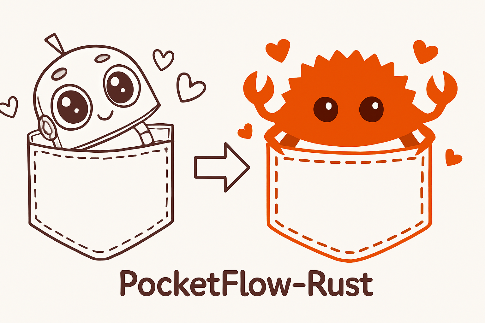

<div align="center">
  
</div>

A Rust implementation of [PocketFlow](https://github.com/The-Pocket/PocketFlow), a minimalist flow-based programming framework.

## Features

- Type-safe state transitions using enums
- Macro-based flow construction
- Async node execution and post-processing
- Batch flow support
- Custom state management
- Extensible node system

## Quick Start

### 0. Setup

```bash
cargo add pocketflow_rs
```

### 1. Define Custom States

```rust
use pocketflow_rs::ProcessState;

#[derive(Debug, Clone, PartialEq)]
pub enum MyState {
    Success,
    Failure,
    Default,
}

impl ProcessState for MyState {
    fn is_default(&self) -> bool {
        matches!(self, MyState::Default)
    }
    fn to_condition(&self) -> String {
        match self {
            MyState::Success => "success".to_string(),
            MyState::Failure => "failure".to_string(),
            MyState::Default => "default".to_string(),
        }
    }
}

impl Default for MyState {
    fn default() -> Self {
        MyState::Default
    }
}
```

### 2. Implement Nodes

```rust
use pocketflow_rs::{Node, ProcessResult, Context};
use anyhow::Result;
use async_trait::async_trait;

struct MyNode;

#[async_trait]
impl Node for MyNode {
    type State = MyState;

    async fn execute(&self, context: &Context) -> Result<serde_json::Value> {
        // Your node logic here
        Ok(serde_json::json!({"data": 42}))
    }

    async fn post_process(
        &self,
        context: &mut Context,
        result: &Result<serde_json::Value>,
    ) -> Result<ProcessResult<MyState>> {
        // Your post-processing logic here
        Ok(ProcessResult::new(MyState::Success, "success".to_string()))
    }
}
```

### 3. Build Flows

```rust
use pocketflow_rs::{build_flow, Context};

let node1 = MyNode;
let node2 = MyNode;

let flow = build_flow!(
    start: ("start", node1),
    nodes: [("next", node2)],
    edges: [
        ("start", "next", MyState::Success)
    ]
);

let context = Context::new();
let result = flow.run(context).await?;
```

### 4. Batch Processing

```rust
use pocketflow_rs::build_batch_flow;

let batch_flow = build_batch_flow!(
    start: ("start", node1),
    nodes: [("next", node2)],
    edges: [
        ("start", "next", MyState::Success)
    ],
    batch_size: 10
);

let contexts = vec![Context::new(); 10];
batch_flow.run_batch(contexts).await?;
```

## Advanced Usage

### Custom State Management

Define your own states to control flow transitions:

```rust
#[derive(Debug, Clone, PartialEq)]
pub enum WorkflowState {
    Initialized,
    Processing,
    Completed,
    Error,
    Default,
}

impl ProcessState for WorkflowState {
    fn is_default(&self) -> bool {
        matches!(self, WorkflowState::Default)
    }
    fn to_condition(&self) -> String {
        match self {
            WorkflowState::Initialized => "initialized".to_string(),
            WorkflowState::Processing => "processing".to_string(),
            WorkflowState::Completed => "completed".to_string(),
            WorkflowState::Error => "error".to_string(),
            WorkflowState::Default => "default".to_string(),
        }
    }
}
```

### Complex Flow Construction

Build complex workflows with multiple nodes and state transitions:

```rust
let flow = build_flow!(
    start: ("start", node1),
    nodes: [
        ("process", node2),
        ("validate", node3),
        ("complete", node4)
    ],
    edges: [
        ("start", "process", WorkflowState::Initialized),
        ("process", "validate", WorkflowState::Processing),
        ("validate", "process", WorkflowState::Error),
        ("validate", "complete", WorkflowState::Completed)
    ]
);
```

## Available Features

The following features are available: (feature for [utility_function](https://the-pocket.github.io/PocketFlow/utility_function/))

- `openai` (default): Enable OpenAI API integration for LLM capabilities
- `websearch`: Enable web search functionality using Google Custom Search API
- `qdrant`: Enable vector database integration using Qdrant
- `debug`: Enable additional debug logging and information

To use specific features, add them to your `Cargo.toml`:

```toml
[dependencies]
pocketflow_rs = { version = "0.1.0", features = ["openai", "websearch"] }
```

Or use them in the command line:

```bash
cargo add pocketflow_rs --features "openai websearch"
```

## Examples

Check out the `examples/` directory for more detailed examples:

- basic.rs: Basic flow with custom states
- text2sql: Text-to-SQL workflow example
- [pocketflow-rs-rag](./examples/pocketflow-rs-rag/README.md): Retrieval-Augmented Generation (RAG) workflow example

## License

MIT
